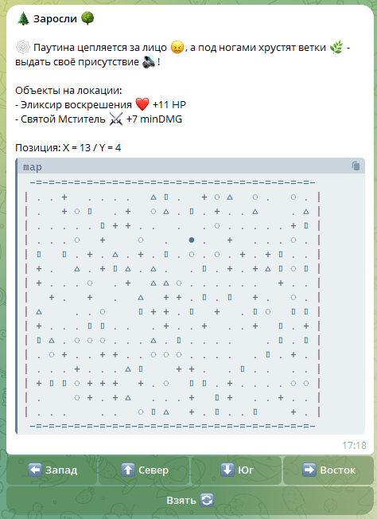

# Text_RPG_bot_TG


Текстовая RPG (MUD‑подобная) в Telegram: исследуйте процедурно сгенерированный мир, сражайтесь с монстрами, собирайте предметы и прокачивайте героя.


## Описание игры
- **Контент**: 134 предмета (100 оружий + 34 лечебных), 10 типов локаций, 55 видов монстров.
- **Цель**: выжить, исследуя мир, и найти что‑нибудь ценное, пока монстры не нашли вас первыми.

## Запуск (Windows)

### Требования
- **Node.js LTS** (вместе с npm)

### Настройка
1) Установите зависимости:

```bash
npm install
```

2) Создайте файл `.env` в корне проекта (рядом с `bot.mjs`).
Проще всего скопировать шаблон:

```bash
copy .env.example .env
```

3) Откройте `.env` и укажите токен бота:

```env
BOT_TOKEN=ВАШ_ТОКЕН_ИЗ_BOTFATHER
```

### Запуск (рекомендуется)

```bash
npm run dev
```

### Быстрый запуск через батник (Windows)
- **Dev-режим (как `npm run dev`)**:

```bat
start_bot.bat
```

- **Обычный запуск без nodemon**:

```bat
start_bot.bat run
```

### Остановка бота
Если бот запущен через `nodemon` или `node bot.mjs` и вы не можете “остановить” его в консоли, используйте:

```bat
stop_bot.bat
```

Чтобы остановить **все** процессы Node.js на машине (осторожно: закроет любые node-приложения):

```bat
stop_bot.bat all
```

### Запуск без батника

```bash
node bot.mjs
```

## Безопасность
- **Не коммитьте токен**: файл `.env` уже добавлен в `.gitignore`.
- Если токен когда-либо попадал в репозиторий/логи — **перевыпустите его через BotFather** и обновите `.env`.
